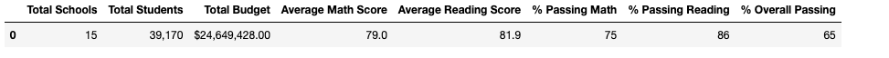
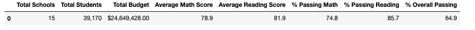
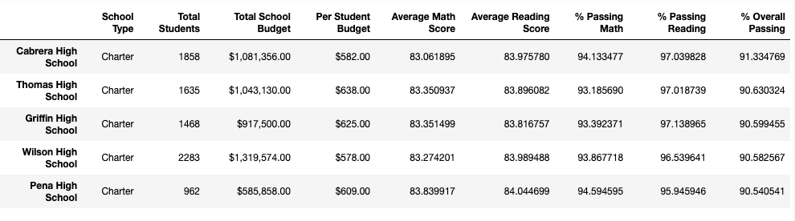
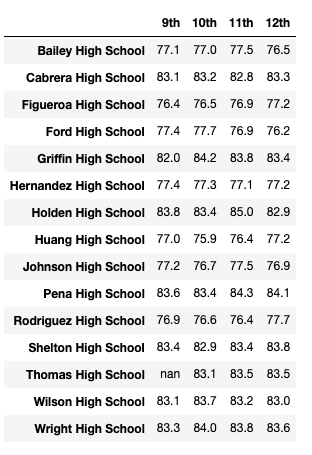
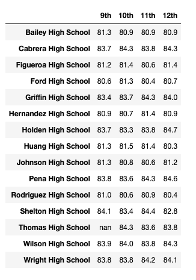
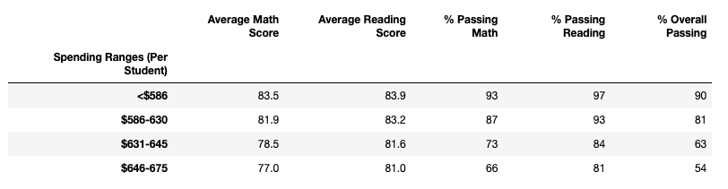
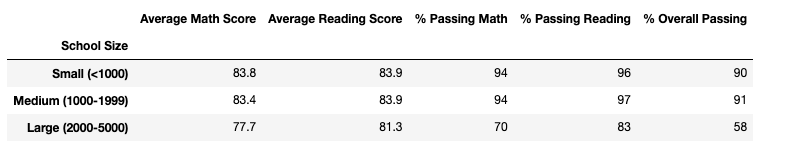
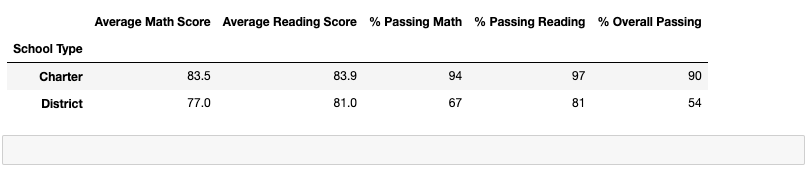

# School_District_Analysis

## Overview of the Project
Utilizing data collected from student standardized math and reading test scores, as well as funding data for each school within the school district, performance trends and patterns did emerge to show significance within different categories.

### Purpose
The purpose of this report is to provide information with which the school board is able to make strategic decisions at the school- and district-level regarding school budgets and priorities.

## Results
The following datasets outline how sigificant the effect was from including the errant test results of 9th graders from Thomas High School at the school-level and how insignificant the effect was when looking at the district-level summary. The more significant factor observed for well-performing schools is whether or not the individual school is a "district" or "charter" school type.

- How is the district summary affected?
    * The district summary is not affected in any significant way including or excluding ninth grade students from Thomas High School.
 
District Summary Including THS 9th Graders:

District Summary After Removing THS 9th Graders:

- How is the school summary affected?
    * On the school-level, if the ninth grade students math and reading scores are included, Thomas High School will report significantly lower results for the categories: Passing Math, Passing Reading, and Overall Passing percentages. 
    * When the ninth grade students students math and reading scores are removed, the Passing Math percentage increased from 66.91% to 93.19%, the Passing Reading percentage increases from 69.66% to 97.02%, and the Overall Passing percentage increases from 65.08% to 90.63%.

School Summary Including THS 9th Graders:

School Summary After Removing THS 9th Graders:

    
- How does replacing the ninth graders’ math and reading scores affect Thomas High School’s performance relative to the other schools?
    * When redacting all Thomas High School ninth grade student's math and reading test scores, the school rises to the top 5 performing schools in the district. 

Top Five Performing Schools:

## Summary
- How does replacing the ninth-grade scores affect the following:
    * Math and reading scores by grade:
        Student data will now show as "nan" in reports for the ninth grade students at Thomas High School.
        
        
    
    * Scores by school spending:
        
    
    * Scores by school size:
        
    
    * Scores by school type:
        
