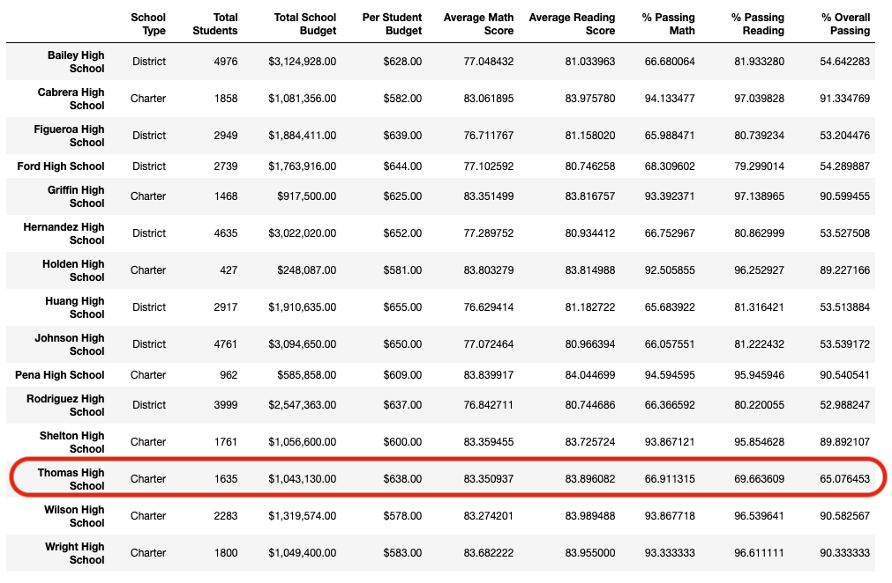
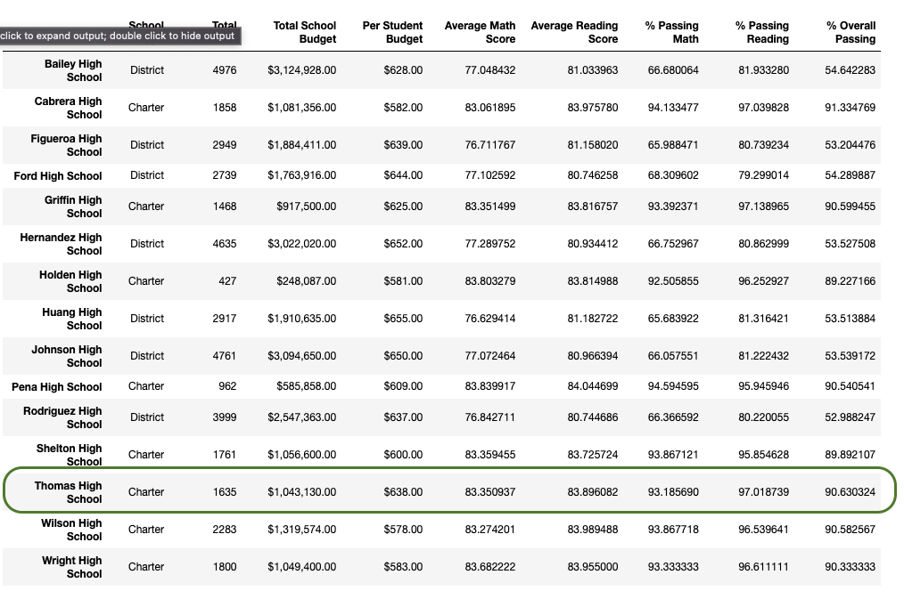

# School_District_Analysis

## Overview of the Project
Utilizing data collected from student standardized math and reading test scores, as well as funding data for each school within the school district, performance trends and patterns did emerge to show significance within different categories.

### Purpose
The purpose of this report is to provide information with which the school board is able to make strategic decisions at the school- and district-level regarding school budgets and priorities.

## Results
The following datasets outline how insigificant the effect was for the district, from including the errant test results of 9th graders from Thomas High School. The more significant factor observed for well-performing schools is whether or not the individual school is a "district" or "charter" school type.

- How is the district summary affected?
    * The district summary is not affected in any significant way including or excluding 9th grade students from Thomas High School.
    

- How is the school summary affected?

    
- How does replacing the ninth graders’ math and reading scores affect Thomas High School’s performance relative to the other schools?
    * On the school-level, if the 9th grade students are included, Thomas High School will report significantly lower results for the categories: Passing Math, Passing Reading, and Overall Passing percentages.

## Summary
(Summarize four changes in the updated school district analysis after reading and math scores for the ninth grade at Thomas High School have been replaced with NaNs.)
    
- How does replacing the ninth-grade scores affect the following:
    * Math and reading scores by grade
    * Scores by school spending
    * Scores by school size
    * Scores by school type

I would recommend creating a table and chart to identify the fundraising goal amounts, launch date, length of campaign, and amount of donors for the top 10 most successful theater campaigns.
